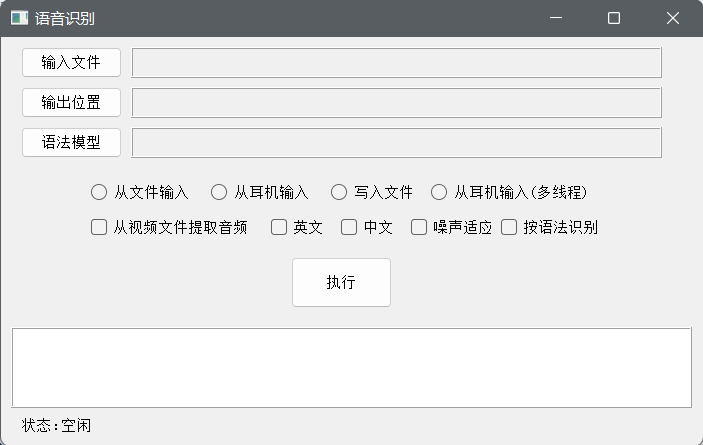
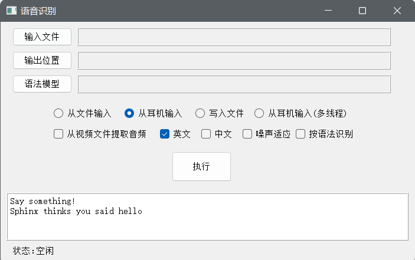
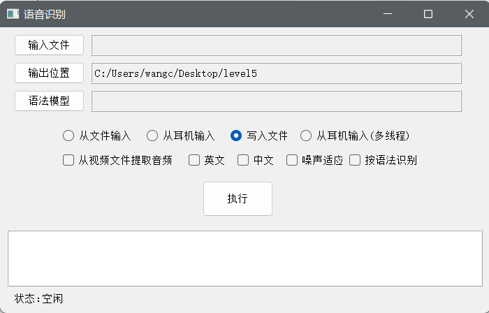
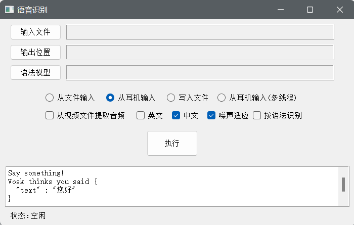
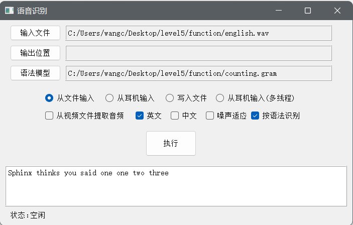
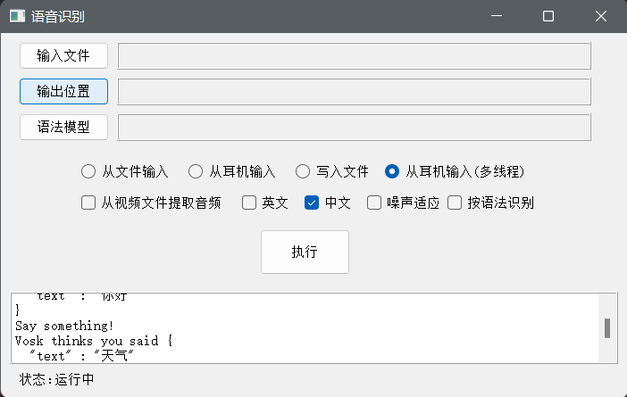
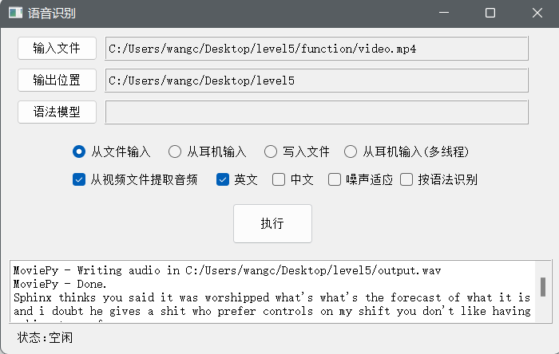

# Level 5

## 环境配置

conda 4.13.0

执行`conda create -n speech_recognition python=3.6`创建python3.6环境

执行`conda activate speech_recognition`激活环境

从github clone [speech_recognition](https://github.com/Uberi/speech_recognition)项目

在clone的项目下执行`python setup.py install`安装speech-recognition

执行`pip install PyAudio PocketSphinx Vosk PyQt5 moviepy ` 安装所需库

参考版本如下

PyAudio             0.2.11

pocketsphinx        0.1.15

vosk                0.3.42

PyQt5               5.15.6

moviepy             1.0.3

下载vosk的[model](https://alphacephei.com/vosk/models)并解压于根目录model文件夹下，改变语言需要替换相应模型

根目录结构如下

Mode                 LastWriteTime         Length Name

----                 -------------         ------ ----

da---l         2022/6/30     23:51                examples
da---l         2022/6/30     23:52                model
-a----          2022/7/3     16:06          19181 level4.md

model文件夹下的目录结构如下

Mode                 LastWriteTime         Length Name

----                 -------------         ------ ----

da---l         2022/6/30     23:52                am
da---l         2022/6/30     23:52                conf
da---l         2022/6/30     23:52                graph
da---l         2022/6/30     23:52                ivector
da---l         2022/6/30     23:52                rescore
da---l         2022/6/30     23:52                rnnlm
-a---l          2022/6/2      3:46             94 README

功能复现中所用模型为

[vosk-model-en-us-0.22](https://alphacephei.com/vosk/models/vosk-model-en-us-0.22.zip)

[vosk-model-cn-0.22](https://alphacephei.com/vosk/models/vosk-model-cn-0.22.zip)

## 功能实现

### 命令行工具

主程序为 cli.py

执行`python .\cli.py`查看命令行参数说明

```bash
usage: cli.py [-h] [-i INPUT | -m | -w | -t] [-e] [-en] [-cn] [-a]
              [-g GRAMMAR]

Demo of speech_recognition

optional arguments:
  -h, --help            show this help message and exit
  -i INPUT, --input INPUT
                        audio file path to be transcribed
  -m, --micro           speech recognition from microphone
  -w, --write           write audio from the microphone to files
  -t, --thread          speech recognition from microphone with thread
  -e, --extract         extract mono audio from video
  -en, --english
  -cn, --chinese
  -a, --adjust          adjust for ambient noise levels
  -g GRAMMAR, --grammar GRAMMAR
                        use grammar file
```

举例如下

 `python .\cli.py -i .\function\english.wav -en `识别英文音频文件

 `python .\cli.py -m -cn `识别中文麦克风输入

 `python .\cli.py -w `将麦克风音频写入文件

 `python .\cli.py -t -cn -a `队列识别中文麦克风输入，并适应背景噪声

 `python .\cli.py -i .\function\video.mp4 -e -en `从视频中提取英文音频并识别

 `python .\cli.py -i .\function\english.wav -en -g .\function\counting.gram `根据语法文件识别英文音频

### 图形化界面

执行`python .\graphics.py`打开图形化界面

使用pyqt实现图形化界面，支持输入输出和模型的选取，功能的选择，命令行输出结果查看，运行状态实时显示



### 识别麦克风语音

选择从耳机输入并选择英文或中文后点击执行



### 将音频数据保存到音频文件

选择输出位置并选择写入文件后点击执行



### 通过环境噪声水平校准识别器能量阈值

在识别时额外选择噪声适应




### 按语法识别

使用语法识别语音，语法规则如下

```
grammar counting;

public <counting> = ( <digit> ) +;

<digit> = one | two | three | four | five | six | seven ;
```

即重复出现多次数字

在识别时额外选择按语法识别并选择语法模型



### 队列工作

将接收到的语音信息依次放入队列中，在后台进行处理



### 从视频中提取音频

在选择从文件输入时，勾选从视频文件提取音频，在输入文件处选择视频，在输出位置选择音频文件输出位置，勾选英文或中文后点击执行


